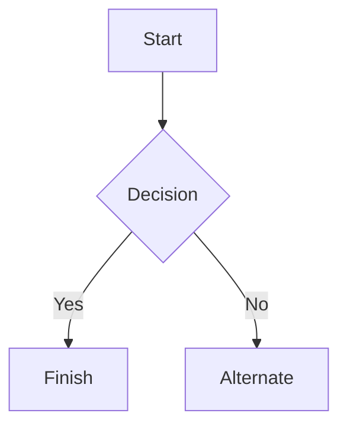

# desafio-github-markdown
[Desafio DIO] Explorando Colaboração e Markdown

---
# MINHAS ANOTAÇÕES DA LINGUAGEM MARKDOWN

---
# Markdown syntax guide

## Headers | Cabeçalho

# This is a Heading h1
## This is a Heading h2
###### This is a Heading h6

## Emphasis | Ênfase

*This text will be italic*  
_This will also be italic_

**This text will be bold**  
__This will also be bold__

_You **can** combine them_

## Lists | Listas

### Unordered | Sem Ordem

* Item 1
* Item 2
* Item 2a
* Item 2b
    * Item 3a
    * Item 3b

### Ordered | Ordenado

1. Item 1
2. Item 2
3. Item 3
    1. Item 3a
    2. Item 3b

## Images | Imagem


## Links

You may be using [Markdown Live Preview](https://markdownlivepreview.com/).

## Blockquotes | Bloco de citação

> Markdown is a lightweight markup language with plain-text-formatting syntax, created in 2004 by John Gruber with Aaron Swartz.
>
>> Markdown is often used to format readme files, for writing messages in online discussion forums, and to create rich text using a plain text editor.

## Tables | Tabelas

| Left columns  | Right columns |
| ------------- |:-------------:|
| left foo      | right foo     |
| left bar      | right bar     |
| left baz      | right baz     |

## Blocks of code | Bloco de Código

```
let message = 'Hello world';
alert(message);
```

## Mermaid diagrams | Diagrama


## Inline code | Linha de Código

This web site is using `markedjs/marked`.

## Emojis para Git
[Lista de Emojis](https://gist.github.com/rxaviers/7360908)

## Ícones
[Ícones](devicon.dev)

Para ajustar o tamanho da imagem/icone usamos um hack em html

